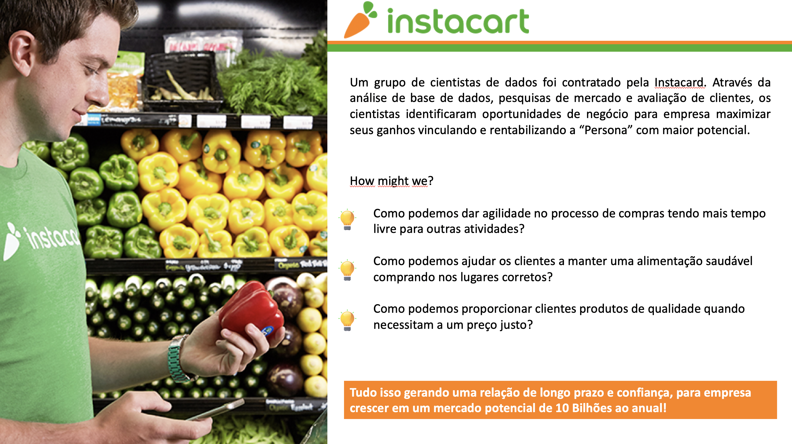
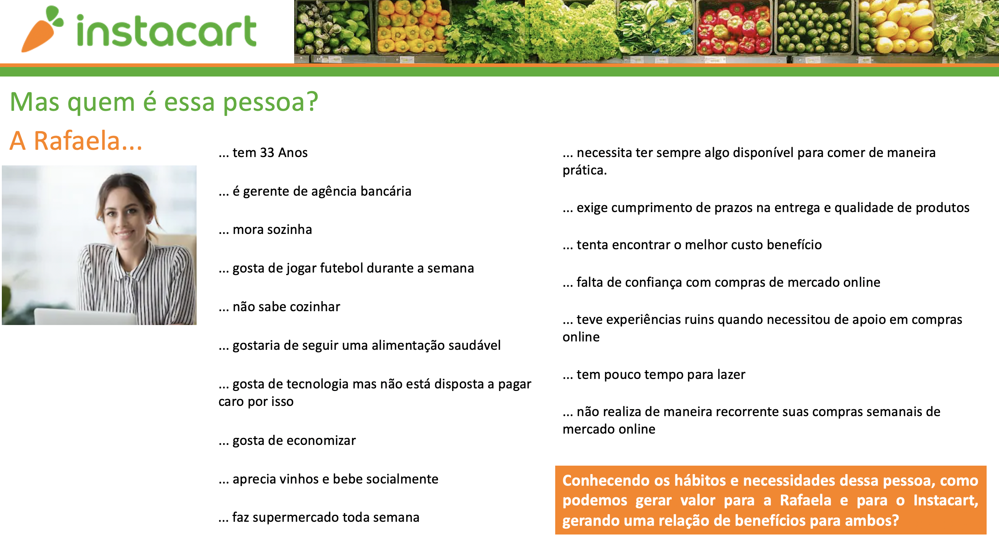
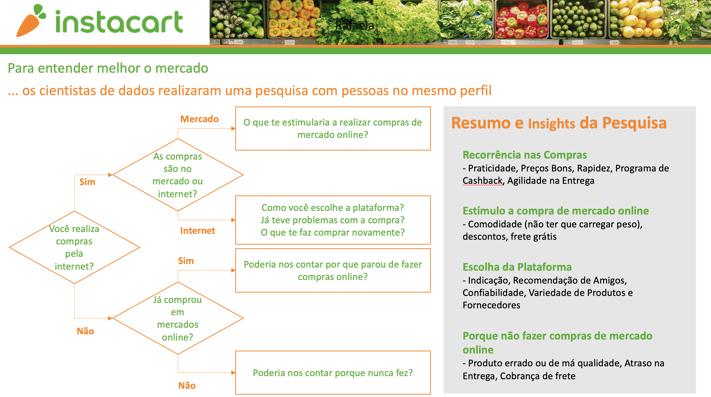
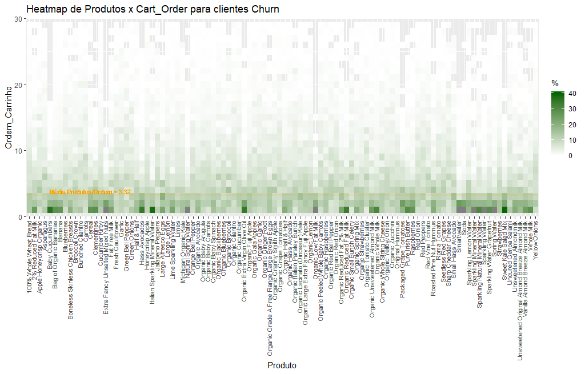
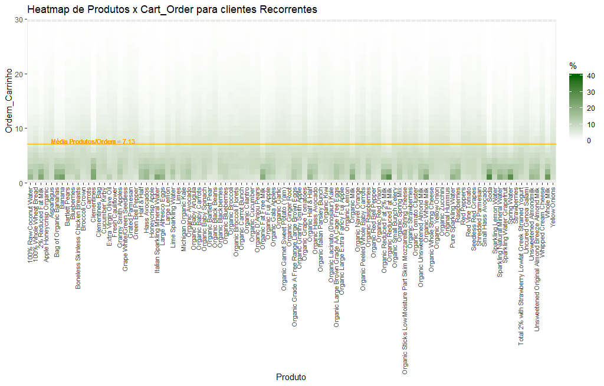
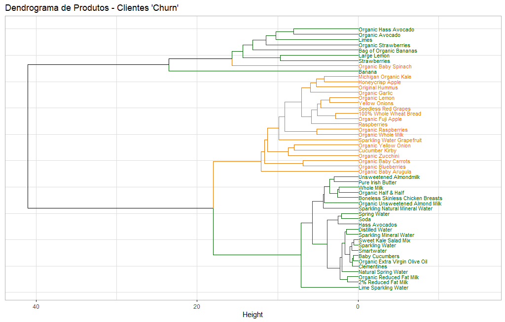
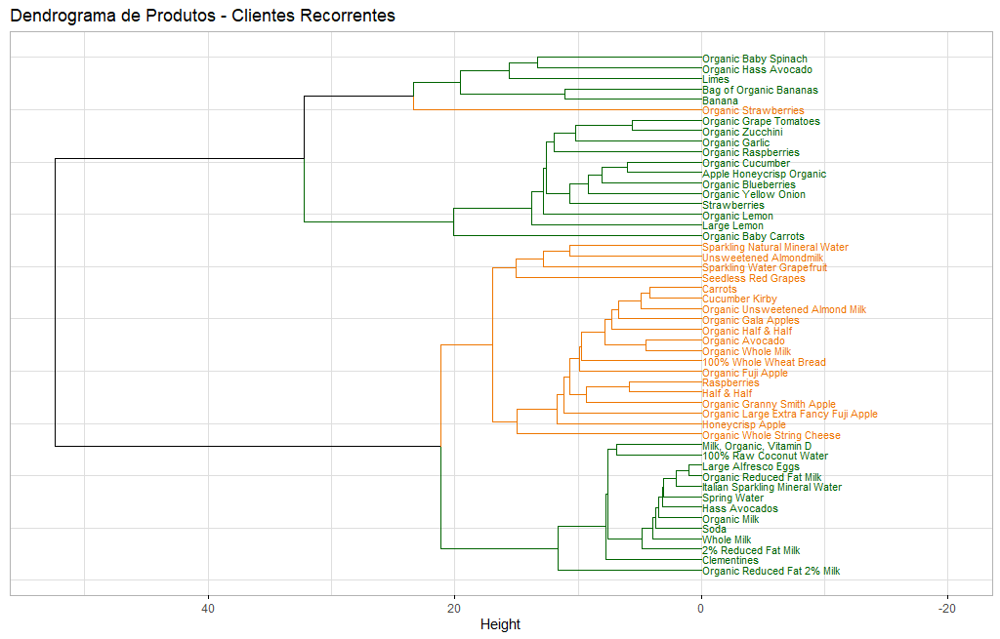

```{r setup, include=FALSE, fig.align = 'center'}
knitr::opts_chunk$set(echo = FALSE, fig.cap = TRUE)

# Pacotes---------------------------------------------------

library(flexdashboard)
library(plotly)
library(tidyverse)
library(skimr)
library(inspectdf)
library(ggrepel)
library(ggthemes)
library(grid)
library(lubridate)
library(grid)
library(plotly)
library(RcppRoll)
library(extrafont)
library(factoextra)
library(dendextend)
library(knitr)

# Identidade visual---------------------------------------------------

#font_import()
#fonts()

theme_set(theme_minimal())
theme_update(text = element_text(family = "Brandon Text"),
             plot.title = element_text(face = "bold"))

source('instacart_palette.R')

options(pillar.sigfig = 1)
```


```{r Importa, include=FALSE, fig.align = 'center'}
# Arquivos ---------------------------------------------------

arquivos <- list.files(path = 'data/', 
                       pattern = "*.csv",
                       full.names = TRUE) %>% sort()

aisles_raw <- read_csv(arquivos[1])

departments_raw <- read_csv(arquivos[2])

op_prior_raw <- read_csv(arquivos[3])

op_train_raw <- read_csv(arquivos[4])

orders_raw <- read_csv(arquivos[5])

products_raw <- read_csv(arquivos[6])
```

```{r Persona, include=FALSE, fig.align = 'center'}
# Persona ---------------------------------------------------


```


```{r Tratamentos, include=FALSE, fig.align = 'center'}
# Pedidos --------------------------------------

orders <- orders_raw %>% 
  mutate(order_hour_of_day = as.numeric(order_hour_of_day))

# Feature Engineering

orders <- orders_raw %>% 
  filter(eval_set != 'test') %>% 
  filter(order_number != 1) %>% 
  arrange(user_id, order_number) %>% 
  mutate(order_hour_of_day = as.numeric(order_hour_of_day),
         w_day = wday(if_else(order_dow == 0, 7, order_dow), label = TRUE)
         #days_since_prior_order = if_else(is.na(days_since_prior_order), 0,
                                          #days_since_prior_order)
         ) %>% 
  group_by(user_id) %>% 
  mutate(days_ma = roll_mean(days_since_prior_order, 5, fill = NA, na.rm = T)) %>% 
  ungroup()

## Média Móvel

hist_ma <- orders %>% 
  na.omit() %>% 
  ggplot(aes(x = days_ma)) +
  geom_bar(fill = ic_cols('dark-green')) +
  geom_vline(xintercept = 8, color = ic_cols('orange'), 
             linetype = 'dashed', size = 0.8, show.legend = TRUE) +
  scale_y_continuous(label = scales::label_number_si()) +
  labs(title = 'Distribuição da média móvel de dias entre os últimos 5 pedidos',
       x = 'Dias desde o último pedido', y = '')

## Grupo de usuários

orders_count <- orders %>% 
  #filter(days_since_prior_order < 30) %>% 
  group_by(user_id) %>% 
  count() %>% 
  transmute(compras = n)


orders2 <- orders %>% 
  left_join(orders_count, by = 'user_id') %>% 
  mutate(abaixo_10 = if_else(compras <= 10, 'Menos de 10 pedidos', 'Mais de 10 pedidos'),
         grupo = case_when(days_ma <= 8 ~ 'Recorrente',
                           days_ma < 30 ~ 'Alvo',
                           days_ma >= 30 ~ 'Indefinido',
                           is.na(days_ma) ~ 'Indefinido'),
         grupo = factor(grupo, levels = c('Recorrente', 'Alvo' , 'Indefinido'), ordered = TRUE))

orders_grouped <- orders2 %>% 
  group_by(w_day, order_hour_of_day, grupo, abaixo_10) %>% 
  summarise(avg_compras = mean(compras, na.rm = T),
            avg_days = mean(days_since_prior_order, na.rm = T))

### Grupos

### Value boxes

orders_vb <- orders2 %>% 
  group_by(grupo, abaixo_10) %>% 
  summarise(avg_compras = mean(compras, na.rm = T),
            avg_days = mean(days_since_prior_order, na.rm = T))

## Recorrente

vb_recorrente <- orders2 %>% 
  filter(grupo == 'Recorrente', abaixo_10 == 'Mais de 10 pedidos') %>%
  group_by(user_id) %>% 
  nrow()

vb_means_recorrente <- orders_vb %>% 
  filter(grupo == 'Recorrente', abaixo_10 == 'Mais de 10 pedidos')

## Alvo

vb_alvo <- orders2 %>% 
  filter(grupo == 'Alvo', abaixo_10 == 'Menos de 10 pedidos') %>%
  group_by(user_id) %>% 
  nrow()

vb_means_alvo <- orders_vb %>% 
  filter(grupo == 'Alvo', abaixo_10 == 'Menos de 10 pedidos')


### Heatmatps

hm_total <- orders2 %>% 
  group_by(w_day,order_hour_of_day ) %>% 
  summarise(avg_days = mean(days_since_prior_order, na.rm = T)) %>% 
  ggplot(aes(y = w_day, x = order_hour_of_day, fill = avg_days)) +
  geom_tile() +
  #scale_fill_viridis_c() +
  scale_fill_instacart(discrete = FALSE, palette = 'greens', reverse = TRUE) +
  labs(title = 'Frequência de pedidos (Total)' ,
       y = 'Dia da semana', x = 'Horário', fill = 'Dias desde a última compra')

hm_alvo <- orders_grouped %>% 
  filter(grupo == 'Alvo', abaixo_10 == 'Menos de 10 pedidos') %>% 
  ggplot(aes(y = w_day, x = order_hour_of_day, fill = avg_days)) +
  geom_tile() +
  #scale_fill_viridis_c() +
  scale_fill_instacart(discrete = FALSE, palette = 'greens', reverse = TRUE) +
  labs(title = 'Frequência de pedidos do grupo alvo' ,
       y = 'Dia da semana',x = 'Horário', fill = 'Dias desde a última compra')

hm_recorrente <- orders_grouped %>% 
  filter(grupo == 'Recorrente', abaixo_10 == 'Mais de 10 pedidos') %>% 
  ggplot(aes(y = w_day, x = order_hour_of_day, fill = avg_days)) +
  geom_tile() +
  #scale_fill_viridis_c() +
  scale_fill_instacart(discrete = FALSE, palette = 'greens', reverse = TRUE) +
  labs(title = 'Frequência de pedidos de clientes recorrentes' ,
       y = 'Dia da semana', x = 'Horário', fill = 'Dias desde a última compra')


# Produtos ---------------------------------------------------

# Juntandos bases com infos por id

base_products_names <- products_raw %>% 
  left_join(aisles_raw) %>% 
  left_join(departments_raw) %>% 
  select(product_id, aisle_id, department_id, everything())

# Juntandos bases com infos e base com todos os pedidos
```


```{r Carrinho, include=FALSE, fig.align = 'center'}
# Carrinho ---------------------------------------------------

# source('flex_files/flex_cart.R')


# Pesquisa  ---------------------------------------------------

#source('Pesquisa_Persona.Rmd')

```

Mercado 
=========================================

Row
-----------------------------------------------------------------------

### Total de  pessoas

```{r}

n_pessoas <- 2000000

valueBox(value = formatC(n_pessoas,  big.mark = " ", format = "f", flag = '#', digits = 0), 
         icon = "fa-user",
         color = ic_cols("orange"))

?prettyNum

```

### Ticket médio anual

```{r}

ticket <- 5000

valueBox(value = formatC(ticket, big.mark = " ", format = "g"), 
         icon = "fa-shopping-cart",
         color = ic_cols("orange"))

```

### Potencial

```{r}

n_pessoas <- 2000000
ticket <- 5000

potencial <- n_pessoas*ticket

valueBox(value = formatC(potencial, big.mark = " ", format = "f", flag = '#', digits = 0), 
         icon = "fa-money",
         color = ic_cols("green"))

```

Row
-----------------------------------------------------------------------

```{r}



```

Persona 
=========================================

### Persona

```{r out.width = "100%"}



```


Pesquisa 
=========================================

### Persona

```{r}



```


Pedidos
=======================================================================

Row
-----------------------------------------------------------------------

### Clientes no grupo recorrente {.value-box}

```{r}

recorr_n <- 33758
valueBox(value = prettyNum(recorr_n, big.mark = " "), 
         icon = "fa-users",
         color = ic_cols("green"))

```


### Compras por cliente {.value-box}

```{r}

recorr_mean_compra <- 35.9

valueBox(value = round(recorr_mean_compra, 1), 
         icon = "fa-carrot",
         color = ic_cols("green"))

```


### Dias entre compras {.value-box}

```{r}

recorr_mean_days <- 7.0

valueBox(value = round(recorr_mean_days, 1), 
         icon = "ion-today-outline",
         color = ic_cols("green"))

```


### Produtos na cesta {.value-box}

```{r}

recorr_mean_ticket <- 7.1

valueBox(value = round(recorr_mean_ticket, 1), 
         icon = "ion-today-outline",
         color = ic_cols("green"))

```

Row
-----------------------------------------------------------------------

### Clientes no grupo alvo {.value-box}

```{r}

churn_n <- 15248
valueBox(value = prettyNum(churn_n, big.mark = ' '), 
         icon = "ion-people-outline",
         color = ic_cols("orange"))

```


### Compras por cliente {.value-box}

```{r}

churn_mean_compra <- 3.3

valueBox(round(churn_mean_compra, 1), icon = "fa-carrot",
         color = ic_cols("orange"))

```


### Dias entre compras {.value-box}

```{r}

churn_mean_days <- 28.4

valueBox(round(churn_mean_days, 1), icon = "ion-today-outline",
         color = ic_cols("orange"))

```


### Produtos na cesta {.value-box}

```{r}

churn_mean_ticket <- 3.3

valueBox(value = round(churn_mean_ticket, 1), 
         icon = "ion-today-outline",
         color = ic_cols("orange"))

```


<!-- Row -->
<!-- ----------------------------------------------------------------------- -->
<!-- ### Distribuição -->


<!-- ```{r avg_days} -->

<!-- ggplotly(hist_ma) -->

<!-- ``` -->


<!-- ```{r freq} -->

<!-- freq <- orders2 %>%  -->
<!--   filter(grupo != 'Indefinido') %>%  -->
<!--   group_by(grupo, w_day) %>%  -->
<!--   summarise(n = n()) %>%  -->
<!--   mutate(p = n/sum(n)) %>%  -->
<!--   ggplot(aes(w_day, p, fill = grupo)) + -->
<!--   geom_col(position = "dodge") + -->
<!--   scale_y_continuous(labels = scales::percent_format()) + -->
<!--   scale_fill_instacart(reverse = TRUE) + -->
<!--   labs(title = 'Frequência de pedidos por grupo de clientes' , -->
<!--        x = 'Dia da semana') -->

<!-- ggplotly(freq) -->

<!-- ``` -->


Row
-----------------------------------------------------------------------

### Frequência

```{r heatmap}

ggplotly(hm_total)

```

<!-- ```{r Grupos} -->

<!-- ggplotly(hm_alvo) -->

<!-- ``` -->

<!-- ```{r Recorrente} -->
<!-- ggplotly(hm_recorrente) -->

<!-- ``` -->


Produtos {.storyboard}
=========================================

### Heatmap - Consumidores Churn {data-commentary-width=400}

```{r heat_churn}



#ggplotly(hm1, tooltip = "perc")

```

- 1	Sparkling Water
- 2	**Sweet Kale Salad Mix**
- 3	Red Onion
- 4	Pure Irish Butter
- 5	Bunched Cilantro
- 6	Baby Cucumbers
- 7	Roma Tomato
- 8	Fat Free Milk
- 9	Garlic
- 10	Natural Spring Water
- 11	**Vanilla Almond Breeze Almond Milk**
- 12	**Organic Extra Virgin Olive Oil**
- 13	Packaged Grape Tomatoes
- 14	Jalapeno Peppers
- 15	Orange Bell Pepper
- 16	**Sharp Cheddar Cheese**
- 17	Smartwater
- 18	**Roasted Pine Nut Hummus**
- 19	Sparkling Mineral Water
- 20	**Cereal**
- 21	**Extra Fancy Unsalted Mixed Nuts**
- 22	Green Onions
- 23	Organic Low Fat Milk

***

- **HIPÓTESE:**
- Relação entre a posição do produto no carrinho e a recorrência de compra

- **PREMISSA DA ANÁLISE:**

Categorias:

* **Clientes Churn**: 

    + Clientes < 5 compras: Média simples >= 25 dias
    
    + Clientes >= 5 compras: Última média móvel = 30


- **INSIGHTS:**
* Clientes em Churn tem um perfil de compra muito diferente do grupo recorrente.

* Média de Produtos na cesta: Churn = 3,32 | Recorrentes = 7,13

* Tipos de produtos na cesta: 

    + **Churn**: Predominantemente Bebidas e laticínios (água, leites e Soda) como principais itens do inicio do carrinho
    
        - Alto percentual desses produtos na primeira posição da cesta.
        
        - Produtos que nunca apareceram em lugares mais altos da cesta: Sugere que não fazem compras, e sim pedem produtos avulsos.
        


### Heatmap - Consumidores Recorrentes {data-commentary-width=400}


```{r heat_recorr}



```

- 1 **Organic Kiwi**
- 2	**Organic D'Anjou Pears**
- 3	**Organic Garnet Sweet Potato (Yam)**
- 4	**Organic Navel Orange**
- 5	100% Raw Coconut Water
- 6	**Organic Bartlett Pear**
- 7	Grated Parmesan
- 8	Grape White/Green Seedless
- 9	Extra Virgin Olive Oil
- 10	**Organic Sticks Low Moisture Part Skim Mozzarella String Cheese**
- 11	**Organic Milk**
- 12	**Organic Large Brown Grade AA Cage Free Eggs**
- 13	Clementines, Bag
- 14	Granny Smith Apples
- 15	**Organic Fat Free Milk**
- 16	Total 2% with Strawberry Lowfat Greek Strained Yogurt
- 17	Bartlett Pears
- 18	**Organic Carrot Bunch**
- 19	Pure Sparkling Water
- 20	*Whipped Cream Cheese*
- 21	*Shredded Parmesan*
- 22	**Organic Broccoli Florets**
- 23	**Organic Black Beans**

***

- **HIPÓTESE:**
- Relação entre a posição do produto no carrinho e a recorrência de compra

- **PREMISSA DA ANÁLISE:**
    
* **Clientes Recorrentes**: aqueles que estão acima da mediana de quantidade de pedido.


- **INSIGHTS:**
        
  **Recorrentes**: Cesta mais dispersa, porém com maior quantidade de Hortifruti (Bananas, leites e Soda) como principais itens do inicio do carrinho
    
        - Muito mais orgânicos
        
### Dendro Clientes Churn

```{r dend_Churn}

# library(imager)
# myimg <- load.image("tanglegrama1.png")
# plot(myimg)

```

### Dendro Clientes Recorrentes

```{r dend_Rec}

# library(imager)
# myimg <- load.image("tanglegrama1.png")
# plot(myimg)


```
 